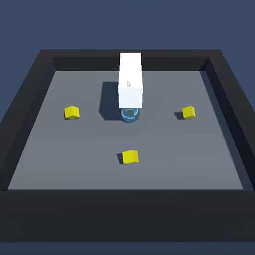
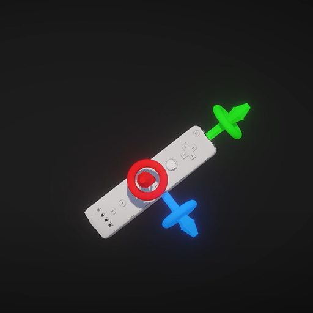
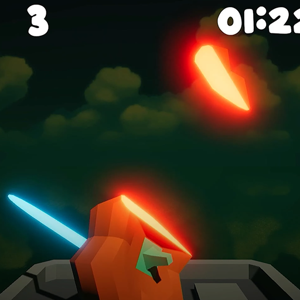

# Wii Are Resorting To Violence - Game Created For Wii U Using Unity

---

  
  
  

---

This project demonstrates creating and running a game on the Wii U console using Unity's 2017 extension for Wii U build support. Inspired by an idea from NBreezi, I developed a more violent take on Wii Sports Resort that takes full advantage of Nintendo's console features. The game showcases how modern Unity development can target retro Nintendo hardware while maintaining engaging gameplay mechanics.

Play The Game: [https://thedevatlas.itch.io/wii-are-resorting-to-violence](https://thedevatlas.itch.io/wii-are-resorting-to-violence)

Check Out Part 1: [https://youtu.be/BKEaG7PdiaA](https://youtu.be/BKEaG7PdiaA)

Check Out Part 2: [https://www.youtube.com/watch?v=OIVhupsDbu8](https://www.youtube.com/watch?v=OIVhupsDbu8)

While this appears to be a simple Nintendo parody game on the surface, it has hidden complexity in console-specific optimization and Unity's legacy build system integration. I used this project to explore Nintendo's development tools and learn about targeting specific hardware limitations while maintaining smooth gameplay.

---
