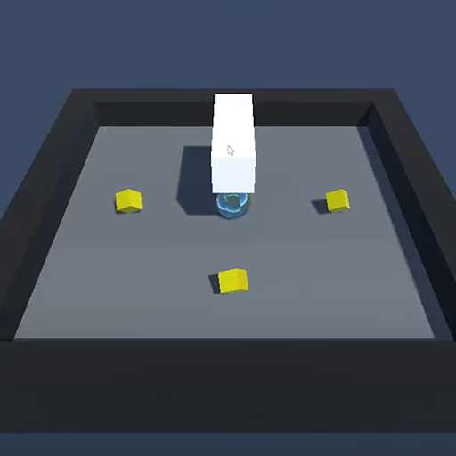
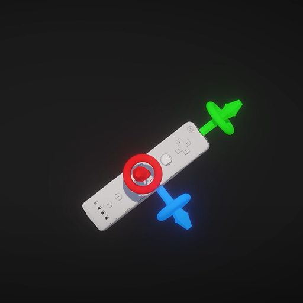
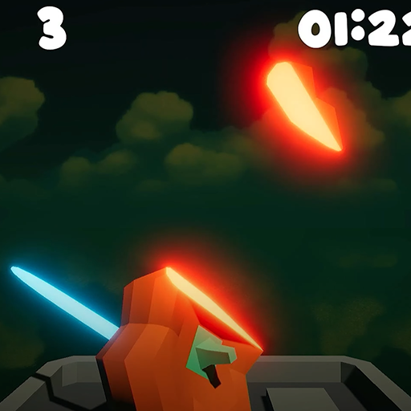

# 🕹️ Wii Are Resorting To Violence 🎯

**'Creating And Running A Game On The Wii U Using Unity'**

---

I was able to find the Unity 2017 extension to add Wii U build support. This lets me have access to all of the features given by Nintendo for the console. I then created an idea that I found in a post by NBreezi which included an idea for a more violent take on Wii Sports Resort.

Play The Game: - https://thedevatlas.itch.io/wii-are-resorting-to-violence
Check Out Part 1: - https://youtu.be/BKEaG7PdiaA
Check Out Part 2: - https://www.youtube.com/watch?v=OIVhupsDbu8

Resources 
- https://www.youtube.com/watch?v=90TMSDYAk-8
- https://gbatemp.net/threads/make-a-unity-game-for-wii-u.633391/
- https://n-breezii.tumblr.com/post/641708690455527424
- https://www.youtube.com/watch?v=OyQ1CpnLyaU

---

  
  
  

